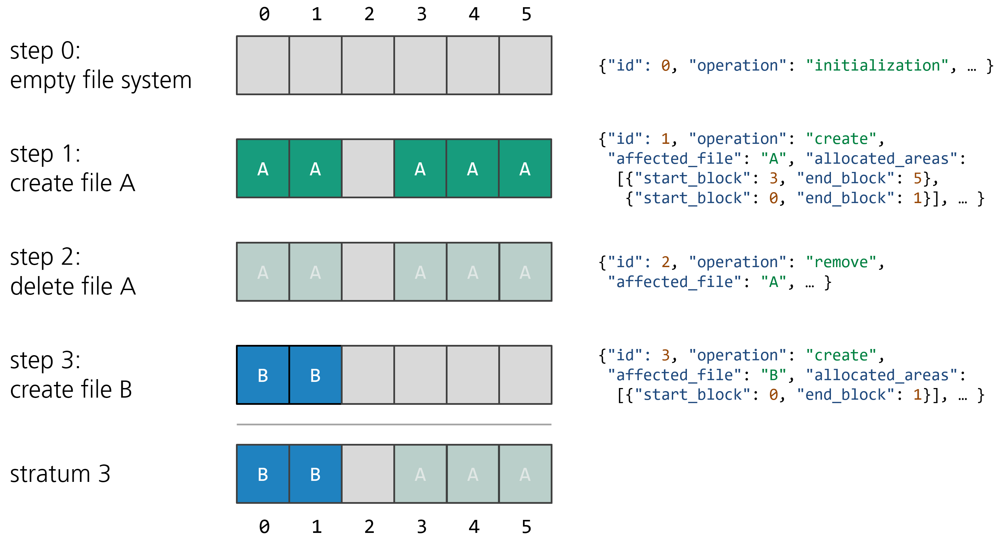

.. fsstratify documentation master file, created by
   sphinx-quickstart on Mon Jul  3 15:57:09 2023.
   You can adapt this file completely to your liking, but it should at least
   contain the root `toctree` directive.

Welcome to fsstratify's documentation!
======================================

While the on-disk structures of file systems are compatible between different implementations, the file system behavior, such as the allocation strategy or default parameters, can differ.
The behavior, however, directly impacts how and where files are stored and heavily influences the degree of fragmentation.
All of these properties are important when performing tasks such as data recovery (especially when file carving is used) or digital stratigraphy.

Most of the knowledge of the behavior of file system implementations stems from laborious experiments where used hard drives were acquired and analyzed.
Although recent works use simulated actions in virtual machines to study the behavior of certain file systems, the overall process is still very tedious.
fsstratify is a framework to significantly reduce the overhead of creating used file systems while at the same time generating realistic traces.
It is cross-platform and supports a variety of file system implementations.

fsstratify uses playbooks to define operations, such as creating, modifying, or deleting files, to be performed on a mounted file system. The execution is carried out by the host operating system using its file system implementation.
Playbooks can be written manually using a simple syntax or they can be automatically generated based on usage models implementing a certain use of the system (e.g. office usage, web server etc.).
After each operation, a file system parser is used to capture the current state of the file system in a log file.
A sequence of successive log lines can be combined into what we call a file system stratum.

The effects of the operations on the file system are logged after every simulation step in a simple machine-readable format.
The log lines contain enough information to be able to infer the state of the file system at any given step during the simulation.
For this, a sequence of log lines is combined into a file system stratum.
A file system stratum n is defined by all log lines with IDs ≤ n.
The following example shows how the information is combined and which information is present in stratum 3.

Analyzing file system strata opens up various possibilities.
It enables detailed studies of file system implementation behavior and we can easily conduct large-scale experiments regarding fragmentation or allocation strategies for both, different file systems and different operating systems.
Moreover, we can use fsstratify to create disk images for testing data recovery techniques.
The strata provide an accurate ground truth about what is still recoverable and what has already been overwritten.

The source code of Woodblock is hosted on :fa:`github` `GitHub`_.

.. toctree::
   :maxdepth: 2
   :caption: Contents:

   usage
   usagemodels
   configfiles
   playbooks
   prepopulation
   operations

Indices and tables
==================

* :ref:`genindex`
* :ref:`modindex`
* :ref:`search`

.. _GitHub: https://github.com/fkie-cad/fsstratify

